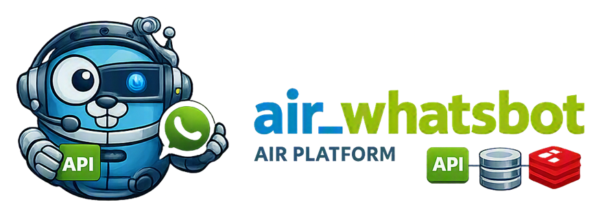

# AiR_Whatsbot



[🇷🇺 Russian version](README.ru.md)


[](https://t.me/marusia_dev)

`air_whatsbot` is a WhatsApp bot service for the AiR platform. It manages user WhatsApp sessions, provides an HTTP/WebSocket API, and exposes a separate gRPC API for voice calls.

## Features

- connect to and manage WhatsApp bots without the Graph API;
- start, stop, and restart user bots;
- retrieve the bot name and check service availability;
- WebSocket connections for authentication and message exchange;
- stream contacts over WebSocket;
- outgoing voice calls through WhatsApp;
- server-streaming call events: transcription, AI responses, errors, and completion;
- store state and configuration in MariaDB/MySQL;
- restore interaction state through Redis;
- Prometheus metrics.

## Architecture

```text
air_whatsbot
├── HTTP :8080
│   ├── /whats/available
│   ├── /whats/getname
│   ├── /whats/enable
│   ├── /whats/disable
│   ├── /whats/restart
│   ├── /whats/ws
│   ├── /whats/contacts/ws
│   └── /metrics
└── gRPC :9090
    └── calls.v1.Calls
        ├── StartOutgoingCall
        ├── SubscribeCallEvents
        └── HangupCall
```

The service receives WhatsApp bot configuration from `air_orchestrator` over gRPC. It also uses MariaDB/MySQL and, optionally, Redis.

## HTTP API

The complete route description is available in the [OpenAPI specification](doc/openapi.yaml).

All routes that operate on a user bot require the `uid` query parameter:

```text
GET /whats/getname?uid=42
```

Main routes:

| Method | Path | Purpose |
|---|---|---|
| GET | `/whats/available` | Check availability |
| GET | `/whats/getname?uid=...` | Get bot name |
| GET | `/whats/enable?uid=...` | Start bot |
| GET | `/whats/disable?uid=...` | Stop bot |
| GET | `/whats/restart?uid=...` | Restart bot |
| GET | `/whats/ws?uid=...` | WebSocket authentication and messaging |
| GET | `/whats/contacts/ws?uid=...` | WebSocket contact stream |
| GET | `/metrics` | Prometheus metrics |

WebSocket routes require the `Upgrade: websocket` header. If `uid` is missing, the server returns `400` with a JSON error.

## gRPC Call API

The gRPC server listens on `:9090` and implements the `calls.v1.Calls` service. In a Docker network, the service is typically available at `whatsbot_app:9090`; locally, use `127.0.0.1:9090`.

Contract: [calls.proto](internal/delivery/rpc/calls.proto).

Typical flow:

```text
StartOutgoingCall
        ↓ call_id
SubscribeCallEvents
        ↓ real-time events
HangupCall (if needed)
        ↓
CALL_ENDED
```

`StartOutgoingCall` accepts `user_id`, `provider`, and `target`, starts the call, and returns a `call_id`. `SubscribeCallEvents` supports `after_sequence` to resume the stream after reconnecting. Audio is not transmitted over gRPC; it is handled inside the WhatsApp service.

## Requirements

- Go 1.25 or newer;
- MariaDB/MySQL;
- Redis — optional, but recommended for state recovery;
- gRPC access to `air_orchestrator`;
- a service key in the `.service_key` file.

## Configuration

Main environment variables:

| Variable | Purpose |
|---|---|
| `DB_HOST` | MariaDB/MySQL address |
| `DB_NAME` | Database name |
| `DB_USER` | Database user |
| `DB_PASSWORD` | Database password |
| `REDIS_ADDR` | Redis address; may be empty |
| `REDIS_PASSWORD` | Redis password |
| `REDIS_DB` | Redis database number |
| `GRPC_CONFIG_HOST` | `air_orchestrator` gRPC address |
| `SERVICE_KEY_FILE` | Service key path |
| `REAL_URL` | Public service domain |
| `LOG_LEVEL` | Logging level |
| `GLOB_USER_MODEL_TTL` | User model TTL in minutes |

Development and production values are specified in [dev.yml](dev.yml) and [prod.yml](prod.yml). Do not add secrets to the repository.

## Running

Run the application locally:

```bash
go run ./cmd
```

Run with Docker Compose:

```bash
docker compose -f dev.yml up -d --build
```

For production, use `prod.yml`:

```bash
docker compose -f prod.yml up -d --build
```

Before starting, create the external networks specified in the Compose files:

```bash
docker network create air_shared
docker network create monitoring_shared
```

## Development

Check formatting and run tests:

```bash
gofmt -w ./cmd ./internal
go test ./...
```

## Related Projects

- [air_orchestrator](https://github.com/ikermy/air_orchestrator) — AiR service configuration and orchestration;
- [air-common](https://github.com/ikermy/air-common) — shared models, realtime providers, and infrastructure components;
- [air-logger](https://github.com/ikermy/air-logger) — logging;
- [air_front](https://github.com/ikermy/air_front) — the platform user interface.

## License

The project is distributed under the [MIT](LICENSE) license. It permits the software to be freely used, copied, modified, and distributed, provided that the license text and copyright notices are preserved.

The full license text is available in the [`LICENSE`](LICENSE) file.

## Contacts

[](https://t.me/ikermy)
